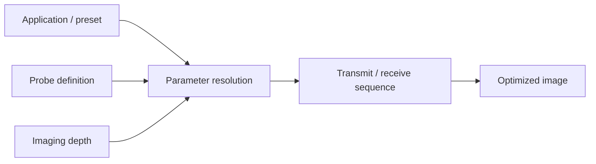

# How Imaging Parameters Are Automated

A Clarius scanner is not a manual front-panel ultrasound machine. Most imaging parameters
are **derived automatically** from three inputs — the **application** (preset) you select,
the **probe** you have attached, and the **depth** you are imaging at — and re-optimized
on the fly as you scan. This page explains that machinery so researchers understand *why*
the numbers in their [raw-data metadata](raw-data-format.md) change from frame to frame,
and what the [low-level parameters](low-level-parameters.md) are actually overriding.

> **These scripts are internal.** End users never see or edit them — the Clarius App
> resolves everything behind a simple depth control and a preset name. They are described
> here only as *baseline conceptual knowledge* so researchers can interpret their captured
> data. Researcher-facing scripting is coming separately through **texo** (see
> [below](#loading-your-own-scripts-texo)), which exposes Clarius-defined,
> research-targeted scripts — not the clinical-grade app scripts shown here.
>
> Examples use representative values from a C3 (curvilinear) probe. Exact coefficients
> vary by probe and preset and evolve between software releases. The resolved value that
> was actually used for any captured frame is always recorded in that frame's `.yml`.

## The three inputs



- **Application** — what you're imaging (abdomen, cardiac, vascular, …). It selects which
  groups of parameter scripts load and sets preset-specific offsets.
- **Probe definition** — fixed physical and electrical properties of the transducer
  (geometry, element count, frequency band, default depth, …).
- **Depth** — the single most important *live* input. Changing depth re-derives transmit
  frequency, focus, sampling/decimation, gain targets, and more.

## Applications, depth regions, and parameter scripts

An application is described by a `description.yml` that maps each supported probe to a
depth control and one or more **depth regions**. Each region loads a named set of
parameter scripts. Conceptually (abridged from the abdomen preset on a C3 probe):

```yaml
control:
  - probe models: [ "C3*" ]
    id: target depth
    assign: endDepth          # the depth slider drives endDepth
    units: cm
    from: 3                    # slider range
    to: 40
    start: 15                  # default depth
    scripts:
      - from: 3                # depth region 3–30 cm
        to: 30
        parameters: [ "C3/gen", "C3/abd", "bf/curved", "dtgc",
                      "enhance/abd", "user/base", "user/general", "modes/standard" ]
      - from: 30               # depth region 30–40 cm
        to: 40
        parameters: [ "C3/gen", "C3/abd", "bf/curved", "dtgc", ... ]
```

Historically an application defined **several** depth regions, and crossing a region
boundary swapped in a different group of scripts — a discrete re-optimization. Newer
software has largely moved away from many discrete regions: a preset now tends to use a
single region (or very few), and the optimization is instead **continuous** — driven by
formulas that take depth as an input rather than by switching script sets. The region
structure still exists internally, but most of the per-depth behavior now lives in the
parameter expressions described below.

The loaded scripts are layered: later files override earlier ones, and `user/base`
provides the shared formulas every preset builds on.

## Probe definitions and bounding frequencies

Each probe ships a `definition.yml` describing its fixed properties. The parts that drive
automation, for a C3HD3:

```yaml
geometry:   { type: curved, elements: 192, pitch: 300 microns, radius: 45 mm }
capabilities: { tx: 64, rx: 32, rxClock: 60MHz, platform: v3 }
stackinfo:  { lowFreq: 2MHz, centerFreq: 3.5MHz, upperFreq: 6MHz }   # transducer band
defaults:   { depth: 10cm, dopplerFreq: 3MHz, compound angle: 7.5 degrees }
freq:                                  # depth → transmit-frequency bounds
  start depth: 1cm
  end depth: 25cm
  lowFreq: 2.5MHz
  upperFreq: 5MHz
```

The `freq` block is the key to depth-based frequency selection: `upperFreq` is used at the
shallow end, `lowFreq` at the deep end, with `start depth`/`end depth` defining the range
over which the system slides between them. Parameter scripts reference these fields with a
`{probe::...}` path, e.g. `{probe::freq::upperFreq}` or `{probe::geometry::elements}`.

## Depth-driven transmit frequency (the "frequency slide")

Higher frequencies give better resolution but attenuate faster; lower frequencies
penetrate deeper. Rather than expose a frequency knob, the system slides transmit
frequency with depth between the probe's bounding frequencies. From `user/base`:

```yaml
txSlideCoef: "max(0cm, min({endDepth}, {probe::freq::end depth}) - {probe::freq::start depth})
              / ({probe::freq::end depth} - {probe::freq::start depth})"
txSlideFreq: "{probe::freq::upperFreq} - ({txSlideCoef} * ({probe::freq::upperFreq} - {probe::freq::lowFreq}))"
```

- `txSlideCoef` runs from **0** (shallow) to **1** (deep) as imaging depth moves across
  the probe's `freq` range.
- `txSlideFreq` therefore interpolates from `upperFreq` (shallow → high resolution) down
  to `lowFreq` (deep → better penetration).

A preset then uses `txSlideFreq` as its transmit frequency, often with a small offset or a
harmonic-imaging override. For the C3 general script:

```yaml
txFreq: "{thiMode} ? {thiFreq} : {txSlideFreq}"   # harmonic mode overrides the slide
```

So when a researcher reduces depth and sees the reported `transmit frequency` rise, that
is the slide at work — not a separate setting.

## Sampling rate and decimation follow depth

Clarius digitizes natively at 60 MHz. Capturing, buffering, and wirelessly transferring
data at full rate is only feasible for shallow imaging, so the **decimation factor**
(how much the data is downsampled) grows with depth to keep each frame within a fixed
native sample budget. From `user/base`:

```yaml
maxBufferNative: 2.5cm                                   # IQ/envelope budget (RF uses 4cm)
safeDecimation:  "max(1, ceil({endDepth} / {maxBufferNative}))"
adjustedDecimation: "({safeDecimation} >= 2 && {safeDecimation} < 3) ? 3 : {safeDecimation}"
```

The resolved decimation feeds the per-mode decimation parameters, e.g. in the C3 script
`iqDecimation: "{adjustedDecimation}"` and `envDecimation: "{iqDecimation} + 5"`.

The practical effect: **the deeper you image, the lower the effective sample rate** of the
data you capture (effective rate ≈ 60 MHz ÷ decimation). For RF specifically this works
out to roughly:

| Depth | RF sampling |
|-------|-------------|
| < 2 cm | 60 MHz |
| 2–4 cm | 30 MHz |
| > 4 cm | 15 MHz |

Always read the actual `sampling rate` (and `size` / `delay samples`) from each frame's
`.yml` rather than assuming a fixed rate — see [raw-data-format.md](raw-data-format.md).

## Auto focus

By default the transmit focus is placed automatically at the middle of the imaging range:

```yaml
autoFocus: true
autoFocusDepth: "{b start depth} + (({b end depth} - {b start depth}) / 2)"
txFocus: "{autoFocus} ? {autoFocusDepth} : {manualFocusDepth}"
```

Turning auto focus off (a standard parameter) lets a fixed focal depth be used instead.

## Auto gain and TGC

Time-gain compensation (TGC) corrects for depth-dependent attenuation so tissue looks
uniformly bright. **Auto gain is enabled by default for many applications** and drives the
gain curve toward a target brightness automatically, which is why captured frames can each
carry a slightly different TGC curve (recorded per frame in the `.tgc.yml`, see
[raw-data-format.md](raw-data-format.md#tgcyml-per-frame-tgc)).

- In **v12**, auto gain adjusted the **analog** TGC (the receive amplifier gain over
  depth).
- In the **latest** software, auto gain adjusts the **digital** TGC gain instead (applied
  in processing). The analog front-end gain is set more conservatively, and the per-depth
  digital offsets come from a script such as `dtgc` (digital-TGC offset points) combined
  with an `autoGainTarget` brightness goal:

```yaml
autoGainTarget: "20dB + {tgcOffsetAg}"   # brightness the auto-gain loop aims for
```

Because of this difference, TGC curves and brightness behavior captured under v12 are not
directly comparable to those captured under the latest software.

## How the parameter expressions work

The scripts are evaluated expressions, not static values. You won't edit the clinical
scripts, but the same expression language underlies the research-targeted scripts you'll
load through [texo](#loading-your-own-scripts-texo), so the conventions are worth knowing:

- **References**: `{name}` pulls another parameter; `{probe::section::field}` pulls a
  field from the probe `definition.yml` (e.g. `{probe::freq::lowFreq}`).
- **Units are first-class**: `2.5MHz`, `40mm`, `15dB`, `20Hz`, `7.5 degrees`. Arithmetic
  respects them.
- **Conditionals**: ternaries like `"{penetrationMode} ? 35V : 30V"` choose values from
  state flags.
- **Layering**: later scripts in a region's list override earlier ones; presets adjust
  shared `user/base` formulas through offsets (e.g. `tgcOffset`, `dynRangeOffset`).

This is why two researchers on the same probe and preset can get different transmit
frequencies, decimation, and gain simply by imaging at different depths — the system
resolved a different set of values for each.

## Loading your own scripts (texo)

> 🚧 **Coming soon.** This section is a forward-looking summary; the texo tooling and its
> repository are not published yet.

The automation above describes the **clinical-grade** scripts that drive the Clarius App —
these are not editable and not exposed to users. For researchers who want direct control
over the transmit/receive sequence, Clarius is releasing **texo**: software that can load
scripts to define imaging behavior at a low level.

What to expect:

- **Research-targeted scripts, not clinical scripts.** texo runs scripts that Clarius
  defines and targets specifically for research use. The clinical app presets shown on
  this page are not loaded into texo.
- **The same expression model.** Scripts use the parameter expression language and
  `{probe::...}` definitions described above, so the concepts here carry over directly.
- **You drive the sequence.** Rather than relying on depth-based automation, a texo script
  fixes the parameters you specify — frequency, focus, aperture, decimation, pulse shape,
  and so on — which is what most acoustic and beamforming research needs.

The same safety considerations as the [low-level parameters](low-level-parameters.md)
apply: scripts can drive the transducer outside the optimized, validated operating points,
so use appropriate test equipment and stay within your regulatory obligations.

Documentation for texo lives in its own repository:
[clariusdev/texo](https://github.com/clariusdev/texo) (pre-release).

## What this means for research

- **Read the metadata per frame.** Frequency, focal depth, sampling rate, decimation, and
  TGC are all consequences of depth and preset and are recorded in each `.yml`/`.tgc.yml`.
  Don't assume they're constant across a capture or between captures.
- **Hold depth fixed** if you need consistent acquisition settings across frames or
  sessions, since depth drives so much of the automation.
- **Override deliberately.** To pin frequency, decimation, gain, focus, or pulse shape to
  fixed values, use the [low-level parameters](low-level-parameters.md) through the Cast
  or Solum APIs — keeping the safety warnings on that page in mind, since you are stepping
  outside the optimized, validated presets.
